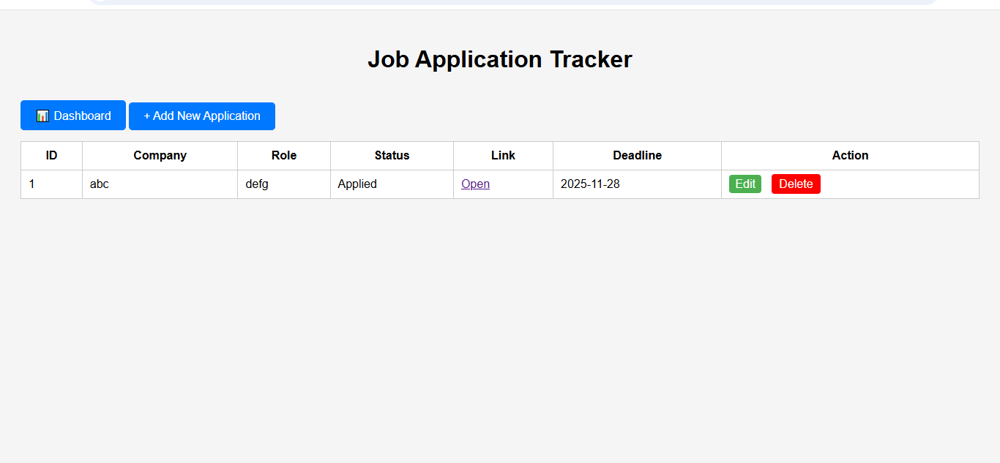
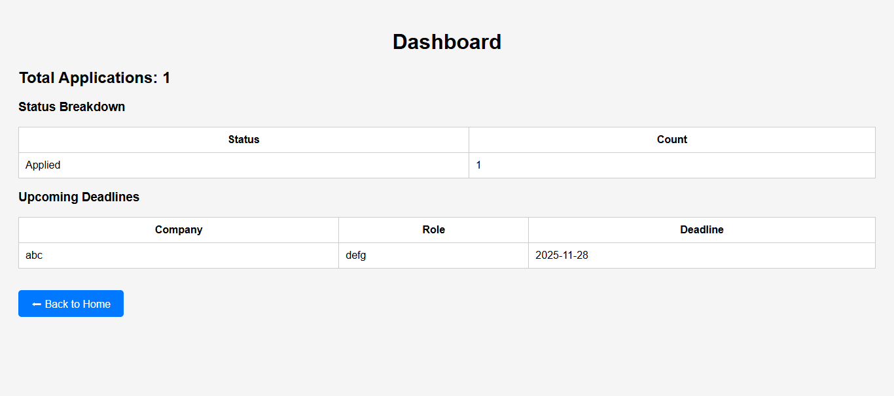

# Job Application Tracker

**Live Demo:** [https://job-application-tracker-uoil.onrender.com](https://job-application-tracker-uoil.onrender.com)

## Overview
A simple web application to track job applications. Users can add, edit, and delete job entries, and view a dashboard with statistics and upcoming deadlines.

## Features
- Add new job applications with company, role, status, link, and deadline
- Edit existing applications
- Delete applications
- Dashboard displaying:
  - Total applications
  - Applications by status
  - Upcoming deadlines

## Screenshots
-Homepage

- Dashboard


## Tech Stack
- Python 3, Flask
- SQLite for database
- HTML/CSS for frontend

## Installation
1. Clone the repository:
   ```bash
   git clone https://github.com/heman315/job-application-tracker.git